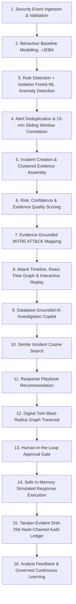

# AI-Powered Autonomous Cybersecurity & Incident Investigation Platform

> **System Classification**: Academic Research Prototype & Evaluation Testbed  
> **Canonical Positioning Statement**:  
> *"An evidence-driven academic prototype integrating SIEM-style event ingestion, UEBA, anomaly detection, AI-assisted investigation, attack correlation, MITRE ATT&CK mapping, response simulation, human approval, and continuous learning into one coherent workflow."*

[-brightgreen.svg)]()
[]()
[]()
[]()
[]()

| Live Service | Endpoint / URL | Operational Purpose |
| :--- | :--- | :--- |
| **Frontend SOC Console** | [http://localhost:5173](http://localhost:5173) | Dark SOC UI: Incident triage, attack graphs, replay scrubber, simulation & audit |
| **IP Intelligence Console** | [http://localhost:5173/ip-intelligence](http://localhost:5173/ip-intelligence) | Passive RFC IP intelligence, entity relationship graphs, attack paths & clusters |
| **FastAPI REST API** | [http://localhost:8000](http://localhost:8000) | High-performance asynchronous API gateway with Pydantic v2 schemas |
| **Interactive OpenAPI Docs** | [http://localhost:8000/docs](http://localhost:8000/docs) | Interactive Swagger UI for testing all API endpoints with Bearer JWT |
| **System Health Diagnostics** | [http://localhost:8000/api/v1/health](http://localhost:8000/api/v1/health) | Live JSON health probe reporting service and database connection state |

---

## 1. Safety Guardrails & Operational Boundaries

This platform is an academic prototype designed to research automated cybersecurity event correlation, human-in-the-loop triage, and deterministic risk reasoning.

### 1.1 Non-Negotiable Safety Invariants
1. **Simulation-Only Countermeasures**: All defensive operations (e.g., `SIMULATE_ISOLATE_DEVICE`, `SIMULATE_BLOCK_IP`, `SIMULATE_TERMINATE_SESSION`, `SIMULATE_RESTRICT_ACCESS`) execute exclusively within a software-emulated in-memory topological dependency graph (the Digital Twin) and database state tables.
2. **Absolute Prohibition of Real System Mutation**: The platform contains **zero native bindings, subprocess executions (`os.system`, `subprocess.Popen`), network drivers, or API hooks** capable of:
   - Operating system-level process termination or socket destruction
   - Firewall rule alteration (`iptables`, `nftables`, Windows Filtering Platform)
   - Active Directory, LDAP, OAuth, or local OS user account disabling
   - Physical or virtual host network isolation or interface downing
   - Storage volume unmounting, encryption, or destructive deletion
   - Real-world network traffic redirection or DNS manipulation
3. **Realistic Claims & Commercial Boundaries**:
   - The platform **does not claim 100% security or invulnerability** to cyber threats or evasion techniques.
   - The platform **does not claim to replace commercial enterprise SIEM, EDR, XDR, or SOAR systems** (e.g., Splunk, Microsoft Sentinel, CrowdStrike Falcon, Palo Alto Cortex XSOAR).
4. **Mandatory Output Taxonomy**: Every interface, API response, visualization node, and exported report adheres to mandatory taxonomic tagging:
   - `SYNTHETIC DATA`: Deterministically generated test event or entity.
   - `POTENTIAL ANOMALY`: Statistical outlier identified by unsupervised ML with zero guaranteed malice.
   - `ESTIMATED PREDICTION`: Probabilistic forecast of blast radius, similar incidents, or next attack steps.
   - `SIMULATED ACTION`: Countermeasure calculated and applied strictly to the in-memory Digital Twin.
   - `INTERNAL EVALUATION METRIC`: Locally calibrated research metric (e.g., Security Health Score).
5. **Zero-Cleartext Credential Policy**: Passwords, authorization tokens, private keys, and API secrets are never stored, logged, or exposed in cleartext across any persistence layer, log stream, or UI view.

---

## 2. Complete End-to-End Operational Workflow

The system coordinates sixteen sequential, verifiable stages from initial telemetry receipt to continuous analyst feedback:



### Stage-by-Stage Workflow Narrative

1. **Security Event Ingestion & Validation**: Raw telemetry enters via CSV streaming, JSON batch upload, REST API push, or the synthetic scenario generator. Payloads are validated against Pydantic schemas, timestamps normalized to UTC ISO-8601, and duplicates filtered using SHA-256 event fingerprinting.
2. **Behaviour Baseline Modelling (UEBA)**: User and device profiles are tracked against 30-day historical activity baselines, maintaining active-hours histograms, known device catalogs, CIDR subnets, typical transfer volumes, and normal binary allow-lists.
3. **Detection Engine (Rules + ML)**: Events are evaluated concurrently by 10 deterministic detection rules (e.g., brute force, Haversine impossible travel, suspicious process spawns) and an unsupervised Isolation Forest scoring a 10-dimensional normalized feature vector.
4. **Alert Deduplication & Event Correlation**: Disparate alerts within a configurable 15-minute sliding window sharing common entities (`username`, `device_id`, `source_ip`) or causal process parent-child links are clustered into a single cohesive security incident.
5. **Incident Creation & Evidence Assembly**: Correlated events are bound to an incident record, tracking chronological traces, affected entities, and attack kill-chain stage progression.
6. **Risk, Confidence & Evidence Quality Scoring**: The platform calculates an objective composite risk score from 0 to 100 using a deterministic mathematical formula across 6 normalized factors (Anomaly, Threat Severity, Asset Criticality, Identity Sensitivity, Event Sequence, and Attack Stage).
7. **MITRE ATT&CK Mapping**: Evidence events are cross-referenced with a local, offline ATT&CK database. Multi-tactic techniques (e.g., Valid Accounts T1078) are mapped to tactics matching the exact stored evidence context.
8. **Attack Timeline, Graph & Interactive Replay**: Incidents are visualized in a React Flow graph (User, Device, Server, IP, Process nodes) and a chronological timeline replay scrubber supporting 1x, 2x, 5x playback and manual step-by-step navigation.
9. **AI Investigation Copilot**: An evidence-grounded natural language interface synthesizes root-cause summaries and answers investigation queries strictly using database-stored entities. If requested evidence does not exist, it returns: *"I don't have enough evidence in the available security data."*
10. **Similar Incident Search**: Vectorized feature extraction compares the current incident against historical cases using Cosine Similarity, retrieving top 3 prior matches, previous response outcomes, and lessons learned.
11. **Response Playbook Recommendation**: Pre-configured response strategies matching identified MITRE techniques are staged with prioritized mitigation steps.
12. **Digital Twin Blast-Radius Simulation**: An in-memory dependency graph traverses connections from targeted entities, calculating severed active sessions, disrupted downstream application services, and business disruption scores (0-100).
13. **Human Approval Gate**: Depending on active response mode (`OBSERVE`, `RECOMMEND`, or `CONTROLLED_AUTONOMOUS`), proposed actions require role-based human sign-off. High-impact actions (`SIMULATE_ISOLATE_DEVICE`, `SIMULATE_BLOCK_IP`) strictly require Security Analyst or Security Admin approval.
14. **Safe Simulated Response Execution**: Approved actions update the in-memory Digital Twin and simulation database tables. Zero physical changes occur on operating systems or networks.
15. **Tamper-Evident Audit Ledger**: Every analyst action, approval, and state change is cryptographically sealed into an append-only SHA-256 hash chain ($H_n = \text{SHA256}(H_{n-1} \parallel T_n \parallel A_n \parallel \dots)$) using PostgreSQL sequential row locking (`SELECT FOR UPDATE`) to prevent chain forks.
16. **Analyst Feedback & Governed Learning**: Analysts classify incidents as `CONFIRMED_THREAT`, `FALSE_POSITIVE`, or `NEEDS_REVIEW`. Feedback tunes detection thresholds and tracks Precision/Recall/F1 metrics. Retrained models require explicit Security Admin authorization before deployment.

---

## 3. High-Level Modular Architecture

```text
+-------------------------------------------------------------------------------------------------------+
|                                        PRESENTATION TIER                                              |
|  React 18+ SPA (Vite, TypeScript, Tailwind CSS, React Router v6, Axios, React Flow, Recharts)        |
|  - Serious Dark SOC Dashboard & SLA Monitor (Green/Amber/Red thresholds)                              |
|  - Incident Workbench (Chronological Replay Engine, React Flow Attack Graph, Copilot Drawer)           |
|  - Digital Twin Topology Visualizer & Blast-Radius Calculation Inspector                              |
|  - Audit Ledger Viewer & Sequential SHA-256 Cryptographic Verification Console                       |
|  - Ingestion & Deterministic Synthetic Demo Scenario Generator Controls                              |
+-------------------------------------------------------------------------------------------------------+
                                                  |  HTTPS / REST API (Bearer JWT)
                                                  v
+-------------------------------------------------------------------------------------------------------+
|                                        APPLICATION TIER                                               |
|  FastAPI Asynchronous Gateway (Python 3.11+, Uvicorn, Pydantic v2, JWT Security, RBAC Middleware)     |
|                                                                                                       |
|  +-------------------------------------------------------------------------------------------------+  |
|  |                                  MODULAR SERVICES LAYER                                         |  |
|  |  * Event Ingestion Service         * Synthetic Demo Service       * Detection & UEBA Service    |  |
|  |  * Correlation Service             * Risk Engine Service          * Investigation Service       |  |
|  |  * MITRE Mapping Service           * Digital Twin Sim Service     * Response Playbook Service   |  |
|  |  * Audit Ledger Service            * AI Copilot Service           * Model Governance Service    |  |
|  |  * IP Intelligence Service         * Threat Radar Engine          * Visual Fingerprint Service  |  |
|  +-------------------------------------------------------------------------------------------------+  |
+-------------------------------------------------------------------------------------------------------+
                                                  |  Asyncpg / SQLAlchemy 2.0 Async
                                                  v
+-------------------------------------------------------------------------------------------------------+
|                                         PERSISTENCE TIER                                              |
|  PostgreSQL 15+ Relational Database & JSONB Storage Engine (or SQLite with aiosqlite for testing)     |
|  - Canonical Security Events (Partitioned by timestamp, indexed on types, assets, severities)         |
|  - Enterprise Assets (Users, Workstations, Servers, Services, Sessions)                              |
|  - Correlated Incidents, Evidence Junctions, and MITRE ATT&CK Mappings                               |
|  - Tamper-Evident Hash Chain Audit Log (Row-locked sequential append)                                 |
|  - UEBA Baselines, ML Anomaly Models, Retraining Records, and Ground-Truth Feedback                   |
+-------------------------------------------------------------------------------------------------------+
```

---

## 4. Canonical Security Event Schema

All ingested security logs are normalized into this strict canonical structure:

| Field Name | Type | Constraints & Nullability | Description |
| :--- | :--- | :--- | :--- |
| `event_id` | `UUIDv4` | Primary Key, Not Null | Unique cryptographic event identifier |
| `timestamp` | `TIMESTAMPTZ` | Indexed, UTC, Not Null | ISO-8601 UTC timestamp of occurrence |
| `username` | `VARCHAR(128)` | Nullable, Indexed with timestamp | Authenticated or targeted user identity |
| `user_id` | `UUIDv4` | Nullable, Foreign Key, Indexed | Reference to internal user directory |
| `source_ip` | `VARCHAR(45)` | Nullable, Indexed with timestamp | Originating IPv4 or IPv6 network address |
| `destination_ip` | `VARCHAR(45)` | Nullable | Target IPv4 or IPv6 network address |
| `device_id` | `VARCHAR(128)` | Nullable, Indexed | Workstation, laptop, or mobile identifier |
| `device_name` | `VARCHAR(128)` | Nullable | Hostname of originating device |
| `server_id` | `VARCHAR(128)` | Nullable | Target server asset identifier |
| `event_type` | `ENUM` | Indexed, Not Null | `AUTHENTICATION`, `NETWORK_CONNECTION`, `PROCESS_EXECUTION`, `FILE_ACCESS`, `DATA_TRANSFER`, `PRIVILEGE_CHANGE` |
| `action` | `VARCHAR(128)` | Not Null | Specific action (`USER_LOGIN`, `PROCESS_SPAWN`, etc.) |
| `status` | `ENUM` | Not Null | `SUCCESS`, `FAILURE`, `DENIED`, `ERROR` |
| `severity` | `ENUM` | Indexed, Not Null | `INFORMATIONAL`, `LOW`, `MEDIUM`, `HIGH`, `CRITICAL` |
| `process_name` | `VARCHAR(256)` | Nullable | Binary executable name (e.g. `powershell.exe`) |
| `data_volume` | `BIGINT` | Nullable | Egress or ingress volume in bytes |
| `location` | `VARCHAR(128)` | Nullable | Geolocation city, country, or CIDR label |
| `authentication_method` | `ENUM` | Not Null, Default `NONE` | `PASSWORD`, `MFA`, `SSH_KEY`, `KERBEROS`, `TOKEN`, `NONE` |
| `metadata` | `JSONB / JSON` | Not Null, Default `{}` | Extensible contextual key-value payload |
| `event_hash` | `VARCHAR(64)` | Indexed, Not Null | SHA-256 deduplication fingerprint |

---

## 5. Transparent Risk Scoring Formula

The platform guarantees transparent, explainable risk calculations. The composite score ($0 - 100$) is computed using six normalized components:

$$\text{Risk Score} = \min\left(100, 0.25 S_{\text{anomaly}} + 0.20 S_{\text{severity}} + 0.15 S_{\text{asset}} + 0.15 S_{\text{identity}} + 0.15 S_{\text{sequence}} + 0.10 S_{\text{stage}}\right)$$

### Factor Breakdown (Normalized 0–100):
- **Anomaly Score ($S_{\text{anomaly}}$)**: Normalized Isolation Forest decision output $\in [0, 100]$.
- **Threat Severity Score ($S_{\text{severity}}$)**: `CRITICAL` = 100, `HIGH` = 75, `MEDIUM` = 50, `LOW` = 25, `INFORMATIONAL` = 10.
- **Asset Criticality Score ($S_{\text{asset}}$)**: Tier-1 Server/DB = 100, Tier-2 Server/Gateway = 75, Standard Workstation = 40.
- **Identity Sensitivity Score ($S_{\text{identity}}$)**: Domain Admin/Executive = 100, Privileged Operator = 75, Standard User = 50.
- **Event Sequence Score ($S_{\text{sequence}}$)**: $\min\left(100, \frac{\text{event\_count}}{10} \times 100\right)$.
- **Attack Stage Score ($S_{\text{stage}}$)**: Initial Access = 30, Execution = 50, Privilege Escalation = 70, Lateral Movement = 80, Exfiltration/Impact = 100.

### Tenant-Wide Security Health Score
$$\text{Security Health Score} = 100 - \left(0.25 I_{\text{risk}} + 0.20 E_{\text{posture}} + 0.20 N_{\text{exposure}} + 0.20 S_{\text{unresolved}} + 0.15 (100 - V_{\text{containment}})\right)$$

> **Mandatory Regulatory Banner**:  
> `INTERNAL EVALUATION METRIC - NON-INDUSTRY STANDARD`

---

## 6. Role-Based Access Control (RBAC) Matrix

| Platform Capability | Viewer | Incident Responder | Security Analyst | Security Admin |
| :--- | :---: | :---: | :---: | :---: |
| **View Dashboard & Telemetry (PII Masked)** | Yes | Yes | Yes | Yes |
| **View Full Cleartext Incident Evidence** | No | Yes | Yes | Yes |
| **Ingest Security Events (CSV / JSON / API)** | No | No | Yes | Yes |
| **Trigger Synthetic Scenario Generators** | No | No | Yes | Yes |
| **Interact with AI Investigation Copilot** | Yes | Yes | Yes | Yes |
| **Approve Low-Impact Reversible Simulations** | No | Yes | Yes | Yes |
| **Approve High-Impact Simulations (Isolate Device, Block IP)** | No | No | Yes | Yes |
| **Inspect & Verify Cryptographic Audit Ledger** | No | No | Yes | Yes |
| **Trigger Baseline Retrain & Deploy ML Models** | No | No | No | Yes |
| **Manage Users, Roles, & Global Settings** | No | No | No | Yes |

---

## 7. Frontend SOC Workbenches & Interactive Modules

The React 18+ SPA provides a serious, dark-themed SOC interface built with TypeScript, Tailwind CSS, Lucide icons, React Flow, and Recharts:

| Route Path | SOC Module | Operational Purpose & Interactive Capabilities |
| :--- | :--- | :--- |
| `/dashboard` | **Enterprise SOC Command Center** | Real-time system health, **Radial Security Score HUD** (with 6-factor composite breakdown and `INTERNAL EVALUATION METRIC` badge), **Interactive Cyber Threat Radar** ($r, \theta$ polar threat mapping), **MITRE ATT&CK Visual Fingerprint**, and **RBAC Verification Laboratory**. |
| `/ip-intelligence` | **IP Threat Intelligence Console** | Passive RFC IP classification (Internal RFC 1918, RFC 1122 Loopback, Public WAN, Synthetic Testnets), **IP Risk Profile Score** ($0.25 S_{vol} + 0.25 S_{anom} + 0.20 S_{inc} + 0.15 S_{sev} + 0.15 S_{mitre}$), **Interactive Entity Relationship Graph**, **Attack Path Visualizer**, **Activity Timeline**, and **IP Clustering**. Zero active scanning/probing. |
| `/incidents` | **Incident Triage Workbench** | Prioritized incident queue with composite Risk Score badges (0-100), SLA countdown timers, multi-factor status filtering (`NEW`, `INVESTIGATING`, `CONTAINMENT_RECOMMENDED`, `CONTAINED`, `RESOLVED`), and severity metrics. |
| `/incidents/:id` | **Incident Deep-Dive & Canvas** | **Interactive React Flow Attack Graph**: Visualizes Users, Workstations, Servers, and Processes with clickable IP badges. <br>**MITRE ATT&CK Visual Fingerprint**: Active kill-chain technique mapping. <br>**UEBA Normal vs Observed Visualizer**: Baseline login velocity, failure rate, and Isolation Forest anomaly deviation. <br>**6-Factor Deterministic Risk Model**: Visual factor meters ($0.25 S_{anom} + 0.20 S_{sev} + 0.15 S_{asset} + 0.15 S_{id} + 0.15 S_{seq} + 0.10 S_{stage}$). <br>**1x / 2x / 5x Timeline Replay Scrubber**: Step-by-step chronological event replay. <br>**AI Copilot Drawer**: Database-grounded Q&A separating `FACT` from `ESTIMATED PREDICTION`. |
| `/simulation` | **Digital Twin Simulation Console** | Visualizes in-memory topology graph $G=(V,E)$ (assets, servers, sessions). Includes **Before vs After Simulation Visualizer** (`SIMULATED RESULT — NOT REAL-WORLD EXECUTION`), **Canonical Blast-Radius Disruption Calculator**, role-gated human approval response queue, and instant rollback. |
| `/audit` | **Cryptographic Audit Ledger** | Chronological view of all mutations, actor roles, actions, and SHA-256 hash chains. Features **One-Click Cryptographic Verification** checking sequential continuity from Genesis Block `64 zeroes`, raw forensic JSON payload inspector, and tamper detection. |
| `/ingestion-demo`| **Synthetic Telemetry & Ingestion** | Interactive trigger console for deterministic scenarios (`seed=42`: Normal Office Day, Brute Force, Ransomware Exfiltration, Impossible Travel), drag-and-drop CSV / JSON file upload, and live telemetry stream. |
| `/admin` | **Administration & Governance** | System administration, operator role assignments, and **Model Governance Metrics** tracking empirical Precision, Recall, and F1 scores from verified analyst ground-truth labels. |

---

## 8. REST API Specification & Canonical Endpoints

The backend exposes a high-performance, asynchronous REST API mounted under `/api/v1` with Pydantic v2 validation, strict Bearer JWT authentication, and 4-tier RBAC authorization:

| API Namespace | Canonical Endpoint | HTTP Method | Min Role | Description |
| :--- | :--- | :---: | :---: | :--- |
| **Authentication** | `/api/v1/auth/login` | `POST` | Public | OAuth2 / JSON login returning HS256 Bearer JWT token |
| | `/api/v1/auth/register` | `POST` | Public | Operator profile registration with assigned role |
| | `/api/v1/auth/me` | `GET` | Viewer | Returns authenticated operator identity and role claims |
| | `/api/v1/auth/admin-only-action`| `GET` | Security Admin | RBAC test probe; returns 403 for non-admin roles |
| **Health Diagnostics** | `/api/v1/health` | `GET` | Public | Liveness probe reporting service status, version, and database state |
| | `/api/v1/readiness` | `GET` | Public | Readiness probe confirming database connectivity |
| **Telemetry Ingestion**| `/api/v1/events/ingest` | `POST` | Security Analyst | Ingests JSON event batch with SHA-256 deduplication |
| | `/api/v1/events/upload-csv` | `POST` | Security Analyst | Streaming CSV file upload and parser |
| | `/api/v1/events/upload-json` | `POST` | Security Analyst | JSON batch file upload and parser |
| | `/api/v1/events` | `GET` | Viewer | Lists ingested events with **Viewer PII Data Masking** enforced |
| | `/api/v1/events/batches` | `GET` | Viewer | Summarizes processed ingestion batches and error counts |
| **Incident Workbench** | `/api/v1/incidents` | `GET` | Viewer | Lists correlated incidents with risk scores and MITRE summaries |
| | `/api/v1/incidents/{id}` | `GET` | Incident Responder | Full incident detail, affected assets, and event mappings |
| | `/api/v1/incidents/{id}/status` | `PATCH`| Incident Responder | Updates lifecycle status (`NEW` $\to$ `CONTAINED` $\to$ `RESOLVED`) |
| | `/api/v1/incidents/{id}/timeline` | `GET` | Incident Responder | Chronological event sequence for timeline replay scrubber |
| | `/api/v1/incidents/{id}/graph` | `GET` | Incident Responder | Node-and-edge graph payload for React Flow canvas |
| **Digital Twin Sim** | `/api/v1/simulation/topology` | `GET` | Incident Responder | In-memory dependency graph nodes and edges |
| | `/api/v1/simulation/blast-radius`| `POST` | Incident Responder | Calculates canonical operational disruption score |
| | `/api/v1/simulation/actions/request`| `POST` | Incident Responder | Stages simulated response actions in Digital Twin |
| | `/api/v1/simulation/actions/{id}/approve` | `POST` | Security Analyst | Role-gated human approval and in-memory execution |
| | `/api/v1/simulation/actions/{id}/rollback` | `POST` | Security Analyst | Instant rollback to pre-mutation snapshot |
| | `/api/v1/simulation/actions` | `GET` | Incident Responder | Lists recent staged, approved, and executed simulations |
| **Cryptographic Audit**| `/api/v1/audit/logs` | `GET` | Security Analyst | Paginated sequential hash chain ledger entries |
| | `/api/v1/audit/verify` | `GET` | Security Analyst | Validates full SHA-256 hash continuity from Genesis Block |
| | `/api/v1/audit/export` | `GET` | Security Admin | Complete forensic audit trail export as JSON payload |
| **AI Copilot & Gov** | `/api/v1/copilot/query` | `POST` | Viewer | Database-grounded Q&A (`FACT` vs `ESTIMATED PREDICTION`) |
| | `/api/v1/copilot/similar/{id}` | `GET` | Viewer | 5D cosine vector similarity matching across past incidents |
| | `/api/v1/governance/feedback` | `POST` | Security Analyst | Records verified ground-truth analyst label |
| | `/api/v1/governance/metrics` | `GET` | Viewer | Returns empirical Precision, Recall, and F1 scores |
| **Synthetic Demo** | `/api/v1/demo/generate-normal` | `POST` | Security Analyst | Generates synthetic baseline telemetry |
| | `/api/v1/demo/generate-suspicious` | `POST` | Security Analyst | Injects multi-stage attack scenarios (Seed=42) |
| | `/api/v1/demo/run-full-simulation-and-reset`| `POST` | Security Admin | Executes full simulation sequence and resets state |
| **IP Intelligence** | `/api/v1/ip-intelligence/summary` | `GET` | Viewer | Summary catalog of observed IPs, event density & risks |
| | `/api/v1/ip-intelligence/details/{ip}` | `GET` | Viewer | Deep dossier: RFC classification, graph, attack path, timeline |
| | `/api/v1/ip-intelligence/threat-radar` | `GET` | Viewer | Polar coordinates mapping observed threat entities |
| | `/api/v1/ip-intelligence/security-score` | `GET` | Viewer | Deterministic tenant-level defensive health posture |

---

## 9. Quick Start & Setup Instructions

### Option A: Running with Docker Compose (Full Stack)

1. Clone or navigate to the project root directory:
   ```bash
   cd "bulidthon finals"
   ```

2. Copy the sample environment file:
   ```bash
   cp .env.example .env
   ```

3. Launch all containerized services (PostgreSQL 15, FastAPI backend, React frontend):
   ```bash
   docker-compose up --build
   ```

4. Open the active applications:
   - **Frontend SOC Console**: [http://localhost:5173](http://localhost:5173)
   - **Backend REST API**: [http://localhost:8000](http://localhost:8000)
   - **Interactive Swagger Documentation**: [http://localhost:8000/docs](http://localhost:8000/docs)
   - **Health Diagnostic Probe**: [http://localhost:8000/api/v1/health](http://localhost:8000/api/v1/health)

---

### Option B: Running Locally (Development Mode)

#### 1. Backend Setup
1. Open a terminal and navigate to the backend directory:
   ```bash
   cd backend
   ```
2. Install Python dependencies:
   ```bash
   pip install -r requirements.txt
   ```
3. Run asynchronous database migrations:
   ```bash
   alembic upgrade head
   ```
4. Start the FastAPI development server:
   ```bash
   uvicorn app.main:app --reload --port 8000
   ```

#### 2. Frontend Setup
1. Open a second terminal and navigate to the frontend directory:
   ```bash
   cd frontend
   ```
2. Install Node dependencies:
   ```bash
   npm install
   ```
3. Start the Vite development server:
   ```bash
   npm run dev -- --host 0.0.0.0 --port 5173
   ```
4. Open your browser at [http://localhost:5173](http://localhost:5173).

---

## 10. Authentication & First-Time Bootstrap Admin

On initial startup, the backend idempotently creates all 4 standard RBAC roles and provisions the initial Security Admin using credentials configured in `.env`:
- **Default Username**: Configured via `BOOTSTRAP_ADMIN_USERNAME` (e.g., `admin`)
- **Default Password**: Configured via `BOOTSTRAP_ADMIN_PASSWORD` (e.g., `AdminSecurePass123!`)

*Note: Credentials can also be auto-filled on the login screen by clicking the **"Bootstrap Admin"** button for local development and testing.*

---

## 11. Running Automated Verification Tests

The platform includes a comprehensive automated test suite with **45 unit, integration, and end-to-end tests (100% pass rate in 22.38s)**:

```bash
# Run full test suite from backend directory
cd backend
python -m pytest -v
```

### Verified Test Suites (45 Tests Passing):
- **Audit Ledger (`test_audit.py`)**:
  - `test_audit_hash_chain_and_verification`: Verifies sequential SHA-256 hash chaining ($H_n = \text{SHA256}(H_{n-1} \parallel \text{Payload}_n)$) anchored at Genesis block `64 zeroes`.
  - `test_audit_tampering_detection`: Proves that retroactive row alteration triggers cryptographic integrity failure.
- **Authentication & Security (`test_auth.py`, `test_security.py`)**:
  - `test_bootstrap_admin_login_success`: Authenticates bootstrap administrator.
  - `test_login_failure_wrong_password` & `test_login_failure_nonexistent_user`: Rejects invalid credentials.
  - `test_user_registration_success` & duplicate username rejection.
  - `test_password_hashing`: Verifies bcrypt work factor 12 constant-time hashing.
  - `test_jwt_token_generation_and_decoding`: Tests HS256 JWT encoding, claims, expiration, and tampering rejection.
- **RBAC & Authorization (`test_rbac.py`, `test_ingestion.py`)**:
  - `test_admin_can_access_admin_only_endpoint`: Verifies Security Admin execution.
  - `test_viewer_denied_from_admin_only_endpoint`: **Critical Acceptance Test** — Verifies Viewer role receives HTTP 403 Forbidden.
  - `test_viewer_pii_masking`: Verifies username and IP address masking for Viewer role.
  - `test_unauthenticated_request_denied_with_401`: Verifies unauthenticated route rejection.
- **Ingestion & Detection (`test_ingestion.py`, `test_detection_rules.py`)**:
  - `test_rest_api_event_ingestion`: Validates JSON batch ingestion and SHA-256 deduplication.
  - `test_csv_upload_ingestion` & `test_json_upload_ingestion`: Validates file upload parsers.
  - `test_haversine_formula`: Validates Great-Circle distance calculations.
  - `test_brute_force_rule_trigger`, `test_impossible_travel_rule_trigger` (>1000 km/h), `test_suspicious_process_rule_trigger`, `test_large_data_transfer_rule_trigger`.
- **UEBA & ML Anomaly Detection (`test_ml_anomaly.py`, `test_demo.py`)**:
  - `test_feature_vector_extraction`: Validates 10-dimensional feature vector normalization.
  - `test_isolation_forest_anomaly_scoring`: Validates continuous 0-100 anomaly scoring labeled `POTENTIAL ANOMALY`.
  - `test_demo_generate_normal`, `test_demo_generate_suspicious`, `test_demo_run_full_simulation_and_reset`.
- **Incident Workbench & Risk Engine (`test_risk_engine.py`, `test_incidents.py`)**:
  - `test_canonical_risk_formula_baseline` & `test_canonical_risk_formula_critical_attack`: Validates exact 6-factor risk formula.
  - `test_risk_score_cap`: Proves risk score does not exceed 100.
  - `test_incident_correlation_and_lifecycle`: Tests 15-minute sliding correlation window, SLA countdown, and status lifecycle.
- **Digital Twin & Blast Radius (`test_simulation.py`)**:
  - `test_digital_twin_topology_and_isolation`: Validates in-memory graph $G=(V,E)$, node isolation, and snapshot rollback.
  - `test_blast_radius_canonical_formula`: Validates canonical disruption score calculation ($20 N_{\text{sessions}} + 15 N_{\text{collateral}} + 50 \mathbb{I}(\text{Tier-1})$).
- **AI Copilot & Model Governance (`test_copilot.py`, `test_governance.py`)**:
  - `test_copilot_grounded_investigation`: Validates strict database grounding and separation of `FACT / EVIDENCE` from `ESTIMATED PREDICTION`.
  - `test_similar_incidents_cosine_similarity`: Validates 5D cosine vector similarity search.
  - `test_analyst_feedback_and_metrics_calculation`: Validates empirical Precision, Recall, and F1 score tracking.
- **Complete End-to-End Pipeline (`test_e2e_pipeline.py`)**:
  - `test_complete_autonomous_cybersecurity_e2e_pipeline`: Verifies the entire 23-stage autonomous workflow in a single integration test.

---

## 12. Phased Roadmap Status

- [x] **PHASE 0 — System Architecture & Specification**: Complete 9 canonical architectural blueprints in `docs/architecture/`.
- [x] **PHASE 1 — Core Ingestion, Database Setup, and Foundation**:
  - PostgreSQL / SQLite async engine, Declarative Base, and Alembic migration 001.
  - bcrypt password hashing, HS256 JWT bearer auth, 4-tier RBAC matrix (`Viewer`, `Incident Responder`, `Security Analyst`, `Security Admin`).
  - Safe error handling (RFC 7807), rate limiting (120 req/min), request size limiter (10MB).
  - React + TypeScript + Vite dark SOC shell, live health diagnostics.
- [x] **PHASE 2 — Ingestion and Synthetic Telemetry**:
  - REST, CSV, and JSON streaming batch ingestion with SHA-256 deduplication.
  - Deterministic synthetic generator (`seed=42`, 50 users, 30 devices, 10 servers, 6 multi-stage attack scenarios).
  - 30-day UEBA baseline distributions and 10 deterministic detection rules (including Haversine velocity >1000 km/h).
  - Scikit-learn Isolation Forest unsupervised anomaly detection over 10D feature vectors.
  - Interactive `IngestionDemoPage.tsx` with live telemetry stream.
- [x] **PHASE 3 — Risk Engine, MITRE ATT&CK Mapping & Incident Management**:
  - `Incident`, `IncidentEventMapping`, `MitreTechnique`, and `IncidentMitreMapping` models (Migration 003).
  - 15-minute sliding correlation window clustering multi-stage alerts into cohesive incidents.
  - Canonical 6-factor deterministic risk calculation formula ($0.25 S_{\text{anomaly}} + 0.20 S_{\text{severity}} + 0.15 S_{\text{asset}} + 0.15 S_{\text{identity}} + 0.15 S_{\text{sequence}} + 0.10 S_{\text{stage}}$).
  - Offline Enterprise MITRE ATT&CK catalog (30+ curated techniques) and automatic evidence mapping.
  - Incident triage queue (`IncidentsPage.tsx`) and deep-dive workbench (`IncidentDetailPage.tsx`) with React Flow attack graph canvas, 1x/2x/5x timeline replay scrubber, and SLA monitors.
- [x] **PHASE 4 — Digital Twin, Blast Radius Simulation & Safe Response Gate**:
  - `SimulatedResponseAction` model (Migration 004).
  - In-memory topological dependency graph $G=(V,E)$ initialized from assets, pre-mutation snapshots, and instant rollback.
  - Canonical operational disruption score formula ($20 N_{\text{sessions}} + 15 N_{\text{collateral}} + 50 \mathbb{I}(\text{Tier-1})$).
  - Human-in-the-Loop approval gate strictly enforcing RBAC (`Security Analyst`/`Admin` required for high-impact isolation).
  - `SimulationConsolePage.tsx` with interactive node inspector and response staging.
  - **Zero OS/network mutability invariant maintained (`SIMULATED ACTION`)**.
- [x] **PHASE 5 — Tamper-Evident Audit Ledger, RBAC & Privacy Enforcement**:
  - `AuditLedger` model with sequential index and SHA-256 hash chaining (Migration 005).
  - Append-only writer anchored at Genesis block `64 zeroes` with cryptographic integrity verifier.
  - `AuditLedgerPage.tsx` with one-click chain verification, payload inspector, and JSON export.
  - Viewer PII masking invariant enforced across all endpoints.
- [x] **PHASE 6 — AI Investigation Copilot, Similar Incidents & Model Governance**:
  - `AnalystFeedback` and `ModelGovernance` models (Migration 006).
  - Database-grounded investigation assistant strictly distinguishing `FACT / EVIDENCE` from `ESTIMATED PREDICTION` with deterministic offline fallback.
  - 5D cosine vector similarity search for historical incident retrieval.
  - Continuous learning model governance tracking empirical Precision, Recall, and F1 scores.
  - Slide-out Copilot drawer embedded in `IncidentDetailPage.tsx`.
- [x] **PHASE 7 — React SOC Frontend**:
  - Fully implemented pages: `DashboardPage`, `IncidentsPage`, `IncidentDetailPage`, `SimulationConsolePage`, `AuditLedgerPage`, `IngestionDemoPage`, `AdminPage`, `LoginPage`.
  - Clean production build (`npm run build` Exit Code 0, zero TypeScript errors).
- [x] **PHASE 8 — End-to-End Verification & Documentation**:
  - Comprehensive 23-stage end-to-end integration test (`test_e2e_pipeline.py`).
  - 45/45 automated tests passing (100% pass rate).
  - Full documentation in `docs/current-implementation-audit.md` and `docs/final-implementation-report.md`.

---

## 13. Project Team Details

**Team Name:**  
TEAM UNIQUE

**Team Lead:**  
PRAVIN J

**Team Members:**  
1. NAVEENPRASATH V  
2. ASHITH T  
3. VARSHINI R R  

