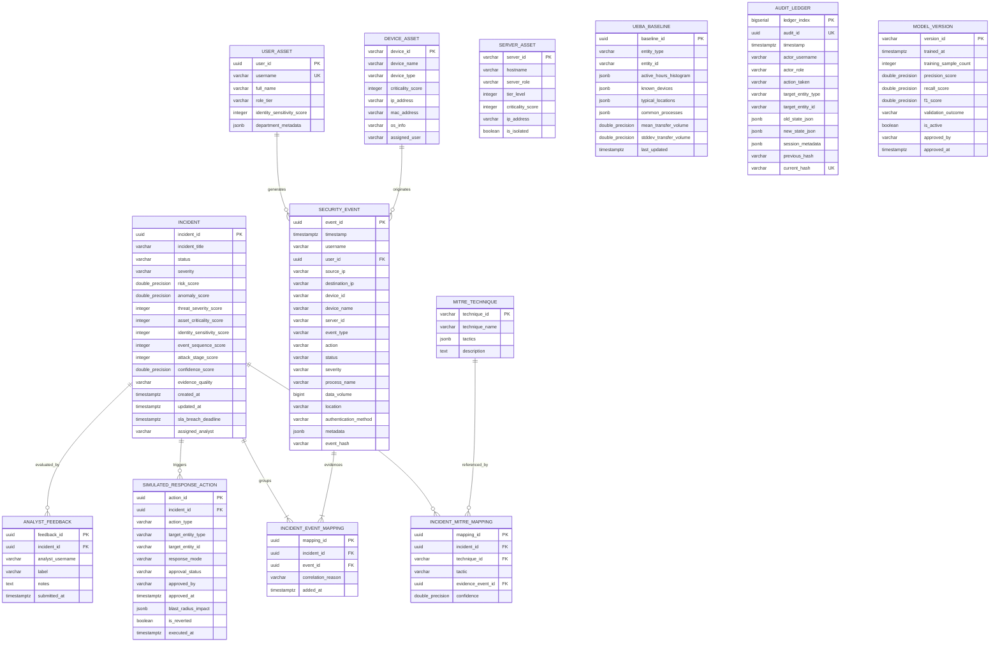

# Database Schema & Entity-Relationship Architecture

> **Storage Engine**: PostgreSQL 15+  
> **ORM Layer**: SQLAlchemy 2.0 (Asyncpg asynchronous driver)  
> **Migration Manager**: Alembic  
> **Schema Standard**: Strict Typing, UUIDv4 Primary Keys, UTC Timestamps, JSONB Metadata, B-Tree & GIN Indexing

---

## 1. Entity Relationship Overview

The diagram below illustrates the core relational and audit models supporting ingestion, correlation, digital twin state, response simulation, and model governance:



---

## 2. Canonical Security Event Schema

Every ingested event from CSV, JSON, REST API, or the synthetic generator is normalized into this canonical format before persistence:

```sql
CREATE TYPE event_type_enum AS ENUM (
    'AUTHENTICATION',
    'NETWORK_CONNECTION',
    'PROCESS_EXECUTION',
    'FILE_ACCESS',
    'DATA_TRANSFER',
    'PRIVILEGE_CHANGE'
);

CREATE TYPE event_status_enum AS ENUM (
    'SUCCESS',
    'FAILURE',
    'DENIED',
    'ERROR'
);

CREATE TYPE event_severity_enum AS ENUM (
    'INFORMATIONAL',
    'LOW',
    'MEDIUM',
    'HIGH',
    'CRITICAL'
);

CREATE TYPE auth_method_enum AS ENUM (
    'PASSWORD',
    'MFA',
    'SSH_KEY',
    'KERBEROS',
    'TOKEN',
    'NONE'
);

CREATE TABLE security_events (
    event_id UUID PRIMARY KEY DEFAULT gen_random_uuid(),
    timestamp TIMESTAMPTZ NOT NULL,
    username VARCHAR(128) NULL,
    user_id UUID NULL,
    source_ip VARCHAR(45) NULL,         -- IPv4 or IPv6
    destination_ip VARCHAR(45) NULL,    -- IPv4 or IPv6
    device_id VARCHAR(128) NULL,
    device_name VARCHAR(128) NULL,
    server_id VARCHAR(128) NULL,
    event_type event_type_enum NOT NULL,
    action VARCHAR(128) NOT NULL,
    status event_status_enum NOT NULL,
    severity event_severity_enum NOT NULL,
    process_name VARCHAR(256) NULL,
    data_volume BIGINT NULL,            -- In bytes
    location VARCHAR(128) NULL,         -- Geo-location or country/city
    authentication_method auth_method_enum NOT NULL DEFAULT 'NONE',
    metadata JSONB NOT NULL DEFAULT '{}'::jsonb,
    event_hash VARCHAR(64) NOT NULL,     -- SHA256(timestamp || username || source_ip || action || process_name)
    created_at TIMESTAMPTZ NOT NULL DEFAULT NOW()
);

-- Performance & Correlation Indexes
CREATE INDEX idx_events_timestamp ON security_events (timestamp DESC);
CREATE INDEX idx_events_user_ts ON security_events (username, timestamp DESC) WHERE username IS NOT NULL;
CREATE INDEX idx_events_src_ip_ts ON security_events (source_ip, timestamp DESC) WHERE source_ip IS NOT NULL;
CREATE INDEX idx_events_device_ts ON security_events (device_id, timestamp DESC) WHERE device_id IS NOT NULL;
CREATE INDEX idx_events_type_status ON security_events (event_type, status);
CREATE INDEX idx_events_hash ON security_events (event_hash);
CREATE INDEX idx_events_metadata_gin ON security_events USING GIN (metadata);
```

---

## 3. Ingestion & Batch Telemetry Tracking

```sql
CREATE TABLE ingestion_batches (
    batch_id UUID PRIMARY KEY DEFAULT gen_random_uuid(),
    source_type VARCHAR(64) NOT NULL,     -- 'CSV_UPLOAD', 'JSON_UPLOAD', 'REST_API', 'SYNTHETIC_GENERATOR'
    filename VARCHAR(256) NULL,
    total_received INTEGER NOT NULL DEFAULT 0,
    valid_events INTEGER NOT NULL DEFAULT 0,
    invalid_events INTEGER NOT NULL DEFAULT 0,
    duplicate_events INTEGER NOT NULL DEFAULT 0,
    stored_events INTEGER NOT NULL DEFAULT 0,
    processing_status VARCHAR(32) NOT NULL DEFAULT 'PROCESSING', -- 'PROCESSING', 'COMPLETED', 'FAILED'
    error_summary JSONB NOT NULL DEFAULT '[]'::jsonb,
    started_at TIMESTAMPTZ NOT NULL DEFAULT NOW(),
    completed_at TIMESTAMPTZ NULL
);

CREATE INDEX idx_ingestion_batches_time ON ingestion_batches (started_at DESC);
```

---

## 4. Asset Inventory & Topology Entities

```sql
CREATE TABLE user_assets (
    user_id UUID PRIMARY KEY DEFAULT gen_random_uuid(),
    username VARCHAR(128) UNIQUE NOT NULL,
    full_name VARCHAR(256) NOT NULL,
    role_tier VARCHAR(64) NOT NULL,       -- 'ADMINISTRATOR', 'PRIVILEGED_USER', 'STANDARD_USER'
    identity_sensitivity_score INTEGER NOT NULL, -- 100 for Admin, 75 for Privileged, 50 for Standard
    department VARCHAR(128) NOT NULL,
    created_at TIMESTAMPTZ NOT NULL DEFAULT NOW()
);

CREATE TABLE device_assets (
    device_id VARCHAR(128) PRIMARY KEY,
    device_name VARCHAR(128) NOT NULL,
    device_type VARCHAR(64) NOT NULL,     -- 'WORKSTATION', 'LAPTOP', 'BYOD'
    criticality_score INTEGER NOT NULL DEFAULT 40, -- 40 for standard workstation
    ip_address VARCHAR(45) NOT NULL,
    mac_address VARCHAR(32) NULL,
    os_info VARCHAR(128) NOT NULL,
    assigned_username VARCHAR(128) NULL REFERENCES user_assets(username),
    is_isolated BOOLEAN NOT NULL DEFAULT FALSE,
    updated_at TIMESTAMPTZ NOT NULL DEFAULT NOW()
);

CREATE TABLE server_assets (
    server_id VARCHAR(128) PRIMARY KEY,
    hostname VARCHAR(128) NOT NULL,
    server_role VARCHAR(64) NOT NULL,     -- 'DATABASE', 'APPLICATION_GATEWAY', 'FILE_SERVER'
    tier_level INTEGER NOT NULL,          -- 1 for Tier-1 (DB, Gateway), 2 for Tier-2 (Internal Web)
    criticality_score INTEGER NOT NULL,   -- 100 for Tier-1, 75 for Tier-2
    ip_address VARCHAR(45) NOT NULL,
    is_isolated BOOLEAN NOT NULL DEFAULT FALSE,
    updated_at TIMESTAMPTZ NOT NULL DEFAULT NOW()
);
```

---

## 5. UEBA Baseline Profiles

```sql
CREATE TABLE ueba_baselines (
    baseline_id UUID PRIMARY KEY DEFAULT gen_random_uuid(),
    entity_type VARCHAR(32) NOT NULL,     -- 'USER', 'DEVICE'
    entity_id VARCHAR(128) NOT NULL,      -- username or device_id
    active_hours_histogram JSONB NOT NULL, -- Probability density or hour counts [0..23]
    known_devices JSONB NOT NULL,         -- Array of verified device IDs
    typical_locations JSONB NOT NULL,     -- Array of verified locations/cities/CIDRs
    common_processes JSONB NOT NULL,      -- Allowlist of typical process names
    mean_transfer_volume DOUBLE PRECISION NOT NULL DEFAULT 0.0,
    stddev_transfer_volume DOUBLE PRECISION NOT NULL DEFAULT 0.0,
    mean_connection_frequency DOUBLE PRECISION NOT NULL DEFAULT 0.0,
    observation_window_days INTEGER NOT NULL DEFAULT 30,
    sample_count INTEGER NOT NULL DEFAULT 0,
    last_updated TIMESTAMPTZ NOT NULL DEFAULT NOW(),
    CONSTRAINT uq_entity_baseline UNIQUE (entity_type, entity_id)
);

CREATE INDEX idx_ueba_entity ON ueba_baselines (entity_type, entity_id);
```

---

## 6. Incidents, Correlation, and Risk Scores

```sql
CREATE TYPE incident_status_enum AS ENUM (
    'NEW',
    'INVESTIGATING',
    'CONTAINMENT_RECOMMENDED',
    'RESPONSE_PENDING',
    'CONTAINED',
    'RESOLVED',
    'FALSE_POSITIVE',
    'CLOSED'
);

CREATE TABLE incidents (
    incident_id UUID PRIMARY KEY DEFAULT gen_random_uuid(),
    incident_title VARCHAR(256) NOT NULL,
    status incident_status_enum NOT NULL DEFAULT 'NEW',
    severity event_severity_enum NOT NULL DEFAULT 'MEDIUM',
    
    -- Composite Risk Score (0 - 100) and Sub-Scores
    risk_score DOUBLE PRECISION NOT NULL,
    anomaly_score DOUBLE PRECISION NOT NULL,             -- 0 - 100
    threat_severity_score INTEGER NOT NULL,              -- 10, 25, 50, 75, 100
    asset_criticality_score INTEGER NOT NULL,            -- 40, 75, 100
    identity_sensitivity_score INTEGER NOT NULL,         -- 50, 75, 100
    event_sequence_score INTEGER NOT NULL,               -- min(100, count/10 * 100)
    attack_stage_score INTEGER NOT NULL,                 -- 30, 50, 70, 80, 100
    
    confidence_score DOUBLE PRECISION NOT NULL,          -- 0 - 100
    evidence_quality VARCHAR(16) NOT NULL,               -- 'LOW', 'MEDIUM', 'HIGH'
    
    primary_username VARCHAR(128) NULL,
    primary_device_id VARCHAR(128) NULL,
    primary_source_ip VARCHAR(45) NULL,
    
    created_at TIMESTAMPTZ NOT NULL DEFAULT NOW(),
    updated_at TIMESTAMPTZ NOT NULL DEFAULT NOW(),
    sla_breach_deadline TIMESTAMPTZ NOT NULL,            -- Default: created_at + 30 mins
    assigned_analyst VARCHAR(128) NULL,
    resolution_notes TEXT NULL
);

CREATE INDEX idx_incidents_status ON incidents (status);
CREATE INDEX idx_incidents_severity ON incidents (severity);
CREATE INDEX idx_incidents_created ON incidents (created_at DESC);
CREATE INDEX idx_incidents_risk ON incidents (risk_score DESC);

CREATE TABLE incident_event_mappings (
    mapping_id UUID PRIMARY KEY DEFAULT gen_random_uuid(),
    incident_id UUID NOT NULL REFERENCES incidents(incident_id) ON DELETE CASCADE,
    event_id UUID NOT NULL REFERENCES security_events(event_id) ON DELETE RESTRICT,
    correlation_reason VARCHAR(256) NOT NULL,
    added_at TIMESTAMPTZ NOT NULL DEFAULT NOW(),
    CONSTRAINT uq_incident_event UNIQUE (incident_id, event_id)
);

CREATE INDEX idx_iem_incident ON incident_event_mappings (incident_id);
CREATE INDEX idx_iem_event ON incident_event_mappings (event_id);
```

---

## 7. MITRE ATT&CK Framework Mapping

```sql
CREATE TABLE mitre_techniques (
    technique_id VARCHAR(32) PRIMARY KEY, -- e.g., 'T1110.001'
    technique_name VARCHAR(256) NOT NULL, -- e.g., 'Password Guessing'
    tactics JSONB NOT NULL,               -- e.g., ['Initial Access', 'Credential Access']
    description TEXT NOT NULL
);

CREATE TABLE incident_mitre_mappings (
    mapping_id UUID PRIMARY KEY DEFAULT gen_random_uuid(),
    incident_id UUID NOT NULL REFERENCES incidents(incident_id) ON DELETE CASCADE,
    technique_id VARCHAR(32) NOT NULL REFERENCES mitre_techniques(technique_id),
    tactic VARCHAR(128) NOT NULL,
    evidence_event_id UUID NOT NULL REFERENCES security_events(event_id),
    confidence DOUBLE PRECISION NOT NULL DEFAULT 85.0,
    mapped_at TIMESTAMPTZ NOT NULL DEFAULT NOW()
);

CREATE INDEX idx_imm_incident ON incident_mitre_mappings (incident_id);
CREATE INDEX idx_imm_technique ON incident_mitre_mappings (technique_id);
```

---

## 8. Digital Twin State & Simulated Response Actions

```sql
CREATE TYPE simulated_action_type_enum AS ENUM (
    'SIMULATE_BLOCK_IP',
    'SIMULATE_ISOLATE_DEVICE',
    'SIMULATE_TERMINATE_SESSION',
    'SIMULATE_RESTRICT_ACCESS',
    'FLAG_USER_FOR_MONITORING'
);

CREATE TYPE approval_status_enum AS ENUM (
    'PENDING_APPROVAL',
    'APPROVED',
    'REJECTED',
    'AUTOMATICALLY_SIMULATED'
);

CREATE TABLE simulated_response_actions (
    action_id UUID PRIMARY KEY DEFAULT gen_random_uuid(),
    incident_id UUID NOT NULL REFERENCES incidents(incident_id) ON DELETE CASCADE,
    action_type simulated_action_type_enum NOT NULL,
    target_entity_type VARCHAR(32) NOT NULL,   -- 'IP', 'DEVICE', 'USER_SESSION'
    target_entity_id VARCHAR(128) NOT NULL,
    response_mode VARCHAR(32) NOT NULL,        -- 'OBSERVE', 'RECOMMEND', 'CONTROLLED_AUTONOMOUS'
    approval_status approval_status_enum NOT NULL DEFAULT 'PENDING_APPROVAL',
    approved_by VARCHAR(128) NULL,
    approved_at TIMESTAMPTZ NULL,
    rejection_reason TEXT NULL,
    blast_radius_impact JSONB NOT NULL,        -- Estimated affected sessions, disrupted services
    risk_reduction_estimate DOUBLE PRECISION NOT NULL,
    is_reverted BOOLEAN NOT NULL DEFAULT FALSE,
    executed_at TIMESTAMPTZ NULL,
    created_at TIMESTAMPTZ NOT NULL DEFAULT NOW()
);

CREATE INDEX idx_sim_actions_incident ON simulated_response_actions (incident_id);
CREATE INDEX idx_sim_actions_status ON simulated_response_actions (approval_status);
```

---

## 9. Tamper-Evident Hash-Chained Audit Ledger

```sql
CREATE TABLE audit_ledger (
    ledger_index BIGSERIAL PRIMARY KEY,
    audit_id UUID UNIQUE NOT NULL DEFAULT gen_random_uuid(),
    timestamp TIMESTAMPTZ NOT NULL DEFAULT NOW(),
    actor_username VARCHAR(128) NOT NULL,
    actor_role VARCHAR(64) NOT NULL,
    action_taken VARCHAR(128) NOT NULL,
    target_entity_type VARCHAR(64) NOT NULL,
    target_entity_id VARCHAR(128) NOT NULL,
    old_state_json JSONB NULL,
    new_state_json JSONB NULL,
    session_metadata JSONB NOT NULL DEFAULT '{}'::jsonb,
    previous_hash VARCHAR(64) NOT NULL,
    current_hash VARCHAR(64) UNIQUE NOT NULL
);

CREATE INDEX idx_audit_timestamp ON audit_ledger (timestamp ASC);
CREATE INDEX idx_audit_current_hash ON audit_ledger (current_hash);
CREATE INDEX idx_audit_actor ON audit_ledger (actor_username);
CREATE INDEX idx_audit_action ON audit_ledger (action_taken);
```

---

## 10. Analyst Feedback & Model Governance

```sql
CREATE TYPE analyst_label_enum AS ENUM (
    'CONFIRMED_THREAT',
    'FALSE_POSITIVE',
    'NEEDS_REVIEW'
);

CREATE TABLE analyst_feedback (
    feedback_id UUID PRIMARY KEY DEFAULT gen_random_uuid(),
    incident_id UUID NOT NULL REFERENCES incidents(incident_id) ON DELETE CASCADE,
    analyst_username VARCHAR(128) NOT NULL,
    label analyst_label_enum NOT NULL,
    notes TEXT NULL,
    submitted_at TIMESTAMPTZ NOT NULL DEFAULT NOW()
);

CREATE INDEX idx_feedback_incident ON analyst_feedback (incident_id);
CREATE INDEX idx_feedback_label ON analyst_feedback (label);

CREATE TABLE model_versions (
    version_id VARCHAR(64) PRIMARY KEY, -- e.g., 'iforest-v1.0.0'
    model_type VARCHAR(64) NOT NULL,    -- 'ISOLATION_FOREST'
    trained_at TIMESTAMPTZ NOT NULL DEFAULT NOW(),
    training_sample_count INTEGER NOT NULL,
    precision_score DOUBLE PRECISION NOT NULL,
    recall_score DOUBLE PRECISION NOT NULL,
    f1_score DOUBLE PRECISION NOT NULL,
    hyperparameters JSONB NOT NULL,
    validation_outcome VARCHAR(64) NOT NULL, -- 'PASSED_BENCHMARK', 'FAILED_THRESHOLD'
    is_active BOOLEAN NOT NULL DEFAULT FALSE,
    approved_by VARCHAR(128) NULL,
    approved_at TIMESTAMPTZ NULL
);
```

---

## 11. Alembic Migration & Partitioning Strategy

### 11.1 Migration Progression Plan
- **Migration 001**: Core ENUMs, Asset inventory tables (`user_assets`, `device_assets`, `server_assets`).
- **Migration 002**: Canonical `security_events` table and associated B-tree & GIN indexes.
- **Migration 003**: Ingestion tracking (`ingestion_batches`) and UEBA baseline tables (`ueba_baselines`).
- **Migration 004**: Incidents and event correlation mappings (`incidents`, `incident_event_mappings`).
- **Migration 005**: MITRE ATT&CK reference and junction models (`mitre_techniques`, `incident_mitre_mappings`).
- **Migration 006**: Digital twin simulated response and approval tables (`simulated_response_actions`).
- **Migration 007**: Cryptographic audit ledger (`audit_ledger`) with Genesis row initialization.
- **Migration 008**: Model governance and analyst feedback (`analyst_feedback`, `model_versions`).

### 11.2 Production Partitioning Strategy
For enterprise-scale event volumes (>1,000,000 events/day), `security_events` is structured for PostgreSQL declarative range partitioning by `timestamp` on a monthly cadence:
```sql
CREATE TABLE security_events_partitioned (
    -- Column definitions identical to security_events
) PARTITION BY RANGE (timestamp);

CREATE TABLE security_events_2026_09 PARTITION OF security_events_partitioned
    FOR VALUES FROM ('2026-09-01 00:00:00+00') TO ('2026-10-01 00:00:00+00');
```
