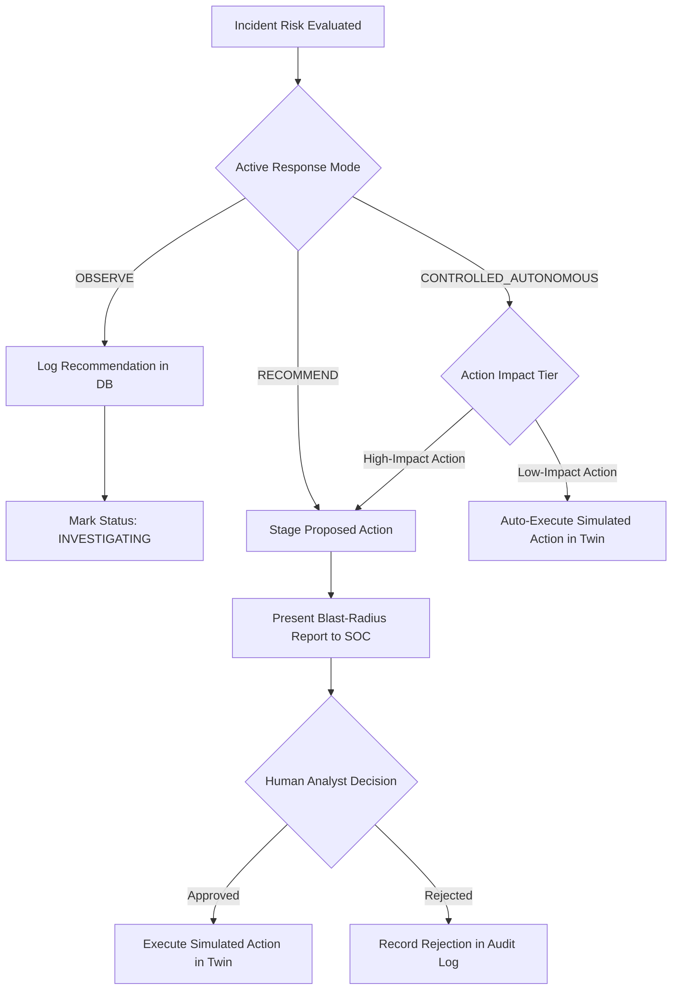

# Digital Twin Graph, Blast-Radius Simulation, and Human Approval Gate

> **Classification**: Isolated In-Memory Emulation & Safe Response Engine  
> **Mandatory Output Marker**: `SIMULATED ACTION`  
> **Safety Invariant**: Zero Operating System or Network Level Mutation

---

## 1. Digital Twin Architecture & State Model

The Digital Twin maintains an in-memory, directed dependency graph representing enterprise IT infrastructure, user identities, active sessions, and communication pathways.

### 1.1 In-Memory Graph Structure ($G = (V, E)$)
The topology is initialized from PostgreSQL asset tables and updated dynamically in memory:

```
[ User: alex.chen ]
       │
       ▼ (owns)
[ Session: SESS-4019 ]
       │
       ▼ (active_on)
[ Workstation: WS-FINANCE-CHEN ] (Device: DEV-WKS-012)
       │
       ▼ (connects_to)
[ Gateway: GW-EDGE-01 ] (Server: SRV-GW-001)
       │
       ▼ (routes_traffic_to)
[ App Server: SRV-APP-FIN ] (Server: SRV-APP-002)
       │
       ▼ (queries)
[ Database: SRV-DB-PROD ] (Server: SRV-DB-001, Tier-1 Critical)
```

### 1.2 Entity Node Types
- **User Node**: Identity sensitivity score (50/75/100), active flag, associated roles.
- **Session Node**: Authenticated session token ID, creation time, associated client IP.
- **Device Node**: Hardware ID, IP address, OS, isolation state (`is_isolated = False`).
- **Server Node**: Hostname, Tier classification (Tier-1 DB, Tier-2 App), service bindings.
- **Service Node**: Running network daemon, listening TCP/UDP port, protocol.
- **Network Connection Edge**: Source IP, destination IP, port, active traffic state.

---

## 2. Safe Simulated Response Actions

All actions execute exclusively within the in-memory Digital Twin graph and update database simulation tables. **No native operating system calls or external network commands are ever issued.**

| Simulated Action Type | Target Entity | Impact Scope | Impact Tier | Reversibility |
| :--- | :--- | :--- | :--- | :--- |
| `SIMULATE_BLOCK_IP` | Source/Dest IP | Drops simulated inbound/outbound packets to target IP address | **High Impact** | Instantaneous |
| `SIMULATE_ISOLATE_DEVICE` | Workstation/Laptop | Severs all twin network edges except simulated SOC telemetry | **High Impact** | Instantaneous |
| `SIMULATE_TERMINATE_SESSION` | User Session | Drops simulated active session edge from User to Device/Service | **Low Impact** | Instantaneous |
| `SIMULATE_RESTRICT_ACCESS` | User Identity | Downgrades user privilege tier to Standard in simulation state | **Low Impact** | Instantaneous |
| `FLAG_USER_FOR_MONITORING` | User Identity | Heightens UEBA sensitivity multiplier without connection disruption | **Low Impact** | Instantaneous |

---

## 3. Blast-Radius Calculation Engine

Before any response action is submitted for human approval or automated execution, the Blast Radius Engine calculates its operational disruption using graph traversal algorithms.

### 3.1 Blast Radius Algorithmic Traversal
When simulating the isolation of a device or blocking of an IP:
1. **Direct Impact Discovery**:
   - Locate target node $v_{\text{target}}$ in Graph $G$.
   - Identify all incident edges $E_{\text{direct}} = \{ (u, v) \in E \mid u = v_{\text{target}} \lor v = v_{\text{target}} \}$.
   - Count severed user sessions: $N_{\text{sessions}} = |\{ u \in V \mid u \text{ is Session and } (u, v_{\text{target}}) \in E \}|$.
2. **Transitive Downstream Impact Discovery**:
   - For all downstream dependent service nodes $s \in V$ reachable only through $v_{\text{target}}$, compute the set of orphaned downstream applications.
   - If an application serves multiple uncompromised users, calculate the count of impacted operational users: $N_{\text{collateral}}$.
3. **Business Disruption Score**:
   $$\text{Disruption Score} = \min\left(100, 20 \cdot N_{\text{sessions}} + 15 \cdot N_{\text{collateral}} + 50 \cdot \mathbb{I}(\text{Tier-1 Disrupted})\right)$$
4. **Estimated Risk Reduction**:
   $$\text{Risk Reduction \%} = \frac{\text{Incident Risk Score} \times \text{Containment Factor}}{\text{Initial Risk Score}} \times 100$$
   Where $\text{Containment Factor} = 0.85$ for `ISOLATE_DEVICE` and $0.70$ for `BLOCK_IP`.

---

## 4. Response Modes & Human-in-the-Loop Approval Gate

The platform supports three distinct operational response modes:



### 4.1 Mode Definitions
- **`OBSERVE`**: The engine generates response recommendations, estimates blast radius, and logs proposals. No state change occurs in the Digital Twin without explicit manual override.
- **`RECOMMEND`**: Every simulated action—regardless of impact—is staged in `PENDING_APPROVAL` status. Execution requires human authorization.
- **`CONTROLLED_AUTONOMOUS`**:
  - **Low-Impact Actions** (`SIMULATE_TERMINATE_SESSION`, `SIMULATE_RESTRICT_ACCESS`, `FLAG_USER_FOR_MONITORING`) execute automatically in the Digital Twin.
  - **High-Impact Actions** (`SIMULATE_ISOLATE_DEVICE`, `SIMULATE_BLOCK_IP`) are strictly blocked by an architectural gate requiring explicit approval from a **Security Analyst** or **Security Admin**.

### 4.2 Reversibility & Rollback Engine
Every executed simulated action stores its pre-mutation state graph snapshot. An authorized analyst can trigger an immediate rollback via `POST /api/v1/simulation/rollback`, instantly restoring severed edges and verifying system state restoration in the tamper-evident audit ledger.
